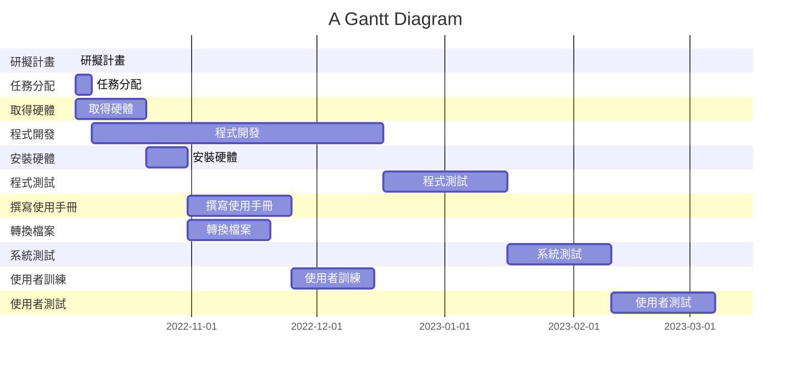

```mermaid
gantt
    title A Gantt Diagram

    section 研擬計畫
    研擬計畫         :active,  des1,2022-10-04  , 2022-10-04
    section 任務分配
    任務分配      :des2, after des1 , 4d
    section 取得硬體
    取得硬體     :des3, after des1 , 17d
    section 程式開發
    程式開發      :des4, after des2 , 70d
    section 安裝硬體
    安裝硬體      :des5, after des3 , 10d
    section 程式測試
    程式測試      :des6, after des4 , 30d
    section 撰寫使用手冊
    撰寫使用手冊      :des7, after des5 , 25d
    section 轉換檔案
    轉換檔案      :des8, after des5 , 20d
    section 系統測試
    系統測試      :des9, after des6 , 25d
    section 使用者訓練
    使用者訓練      :des10, after des7 , 20d
    section 使用者測試
    使用者測試      :des11, after des9 , 25d
```
